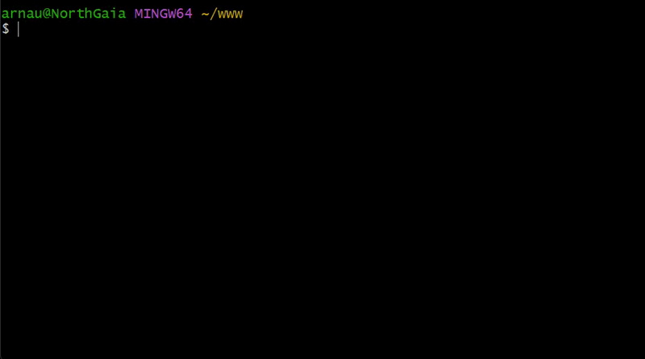

[](https://cecil.app)

A simple and powerful content-driven static site generator.

[](https://github.com/Cecilapp/Cecil/releases/latest)
[](https://github.com/Cecilapp/Cecil/blob/master/LICENSE)  

Cecil is a CLI application that merges plain text files (written in [Markdown](http://daringfireball.net/projects/markdown/)), images and [Twig](https://twig.symfony.com) templates to generate a [static website](https://en.wikipedia.org/wiki/Static_web_page).

📄[Documentation](https://cecil.app/documentation) &middot; 💻[Demo](https://the-butler-demo.cecil.app) &middot; 🐛[Issues tracker](https://github.com/Cecilapp/Cecil/issues) &middot; 💬[Discussions](https://github.com/Cecilapp/Cecil/discussions)



[](https://github.com/Cecilapp/Cecil/actions/workflows/continuous-integration.yml)
[](https://github.com/Cecilapp/Cecil/actions/workflows/release.yml)
[](https://github.com/Cecilapp/Cecil/actions/workflows/documentation.yml)  
[](https://scrutinizer-ci.com/g/Cecilapp/Cecil/)
[](https://app.codacy.com/gh/Cecilapp/Cecil/dashboard)
[](https://coveralls.io/github/Cecilapp/Cecil?branch=master)
[](https://styleci.io/repos/12738012)

## Quick Start

Read the [Quick Start](https://cecil.app/documentation/quick-start/) documentation page.

Create and deploy a blog site:  
[](https://cecil.app/hosting/netlify/deploy/) [](https://cecil.app/hosting/vercel/deploy/)

## Features

- No database, no server, no dependency: performance and security
- Your pages are stored in [Markdown](https://cecil.app/documentation/content/#body) flat files with a [YAML front matter](https://cecil.app/documentation/content/#front-matter)
- Powered by [Twig](https://cecil.app/documentation/templates/), a flexible template engine, with [themes](https://cecil.app/themes) support
- Pagination, sitemap, redirections, robots.txt, taxonomies, RSS are generated automatically
- Handles and optimizes assets for you
- [Download one file](https://github.com/Cecilapp/Cecil/releases/latest/download/cecil.phar) and run it
- Easy to deploy

## Requirements

- [PHP](https://www.php.net) 8.3+

## Installation

Download `cecil.phar` from your terminal:

```bash
curl -LO https://github.com/Cecilapp/Cecil/releases/latest/download/cecil.phar
```

Other installation methods:

- [Homebrew](https://brew.sh): `brew install cecilapp/tap/cecil`
- [Scoop](https://scoop.sh): `scoop install https://cecil.app/scoop/cecil.json`
- Manual download page: [cecil.app/download](https://cecil.app/download/)

## Usage

Common commands:

```bash
php cecil.phar help      # Get help
php cecil.phar new:site  # Create a new website
php cecil.phar build     # Build your website
php cecil.phar serve     # Preview your website locally
```

## Contributing

See [Contributing](CONTRIBUTING.md).

Thanks goes to these wonderful people ([emoji key](https://allcontributors.org/docs/en/emoji-key)):

<!-- ALL-CONTRIBUTORS-LIST:START - Do not remove or modify this section -->
<!-- prettier-ignore-start -->
<!-- markdownlint-disable -->
<table>
  <tbody>
    <tr>
      <td align="center" valign="top" width="25%"><a href="https://ligny.fr"><br /><sub><b>Arnaud Ligny</b></sub></a><br /><a href="https://github.com/Cecilapp/Cecil/issues?q=author%3AArnaudLigny" title="Bug reports">🐛</a> <a href="https://github.com/Cecilapp/Cecil/commits?author=ArnaudLigny" title="Documentation">📖</a> <a href="#ideas-ArnaudLigny" title="Ideas, Planning, & Feedback">🤔</a> <a href="#maintenance-ArnaudLigny" title="Maintenance">🚧</a> <a href="#promotion-ArnaudLigny" title="Promotion">📣</a> <a href="#question-ArnaudLigny" title="Answering Questions">💬</a> <a href="https://github.com/Cecilapp/Cecil/pulls?q=is%3Apr+reviewed-by%3AArnaudLigny" title="Reviewed Pull Requests">👀</a> <a href="#translation-ArnaudLigny" title="Translation">🌍</a> <a href="#talk-ArnaudLigny" title="Talks">📢</a></td>
      <td align="center" valign="top" width="25%"><a href="https://frank.taillandier.me"><br /><sub><b>Frank Taillandier</b></sub></a><br /><a href="https://github.com/Cecilapp/Cecil/commits?author=DirtyF" title="Documentation">📖</a> <a href="#ideas-DirtyF" title="Ideas, Planning, & Feedback">🤔</a> <a href="#promotion-DirtyF" title="Promotion">📣</a> <a href="#translation-DirtyF" title="Translation">🌍</a> <a href="#mentoring-DirtyF" title="Mentoring">🧑‍🏫</a></td>
      <td align="center" valign="top" width="25%"><a href="https://mirell.com"><br /><sub><b>Martin Szulecki</b></sub></a><br /><a href="https://github.com/Cecilapp/Cecil/issues?q=author%3AFunkyM" title="Bug reports">🐛</a> <a href="https://github.com/Cecilapp/Cecil/commits?author=FunkyM" title="Code">💻</a> <a href="#ideas-FunkyM" title="Ideas, Planning, & Feedback">🤔</a></td>
      <td align="center" valign="top" width="25%"><a href="https://www.magentix.fr"><br /><sub><b>Matthieu Vion</b></sub></a><br /><a href="https://github.com/Cecilapp/Cecil/issues?q=author%3Amagentix" title="Bug reports">🐛</a> <a href="https://github.com/Cecilapp/Cecil/commits?author=magentix" title="Code">💻</a></td>
    </tr>
    <tr>
      <td align="center" valign="top" width="25%"><a href="https://github.com/peter279k"><br /><sub><b>Chun-Sheng, Li</b></sub></a><br /><a href="https://github.com/Cecilapp/Cecil/commits?author=peter279k" title="Code">💻</a> <a href="#security-peter279k" title="Security">🛡️</a></td>
      <td align="center" valign="top" width="25%"><a href="https://www.benjaminhirsch.net"><br /><sub><b>Benjamin Hirsch</b></sub></a><br /><a href="https://github.com/Cecilapp/Cecil/issues?q=author%3Abenjaminhirsch" title="Bug reports">🐛</a> <a href="https://github.com/Cecilapp/Cecil/commits?author=benjaminhirsch" title="Code">💻</a></td>
      <td align="center" valign="top" width="25%"><a href="http://kavlak.uk/@ahnlak"><br /><sub><b>Pete Favelle</b></sub></a><br /><a href="https://github.com/Cecilapp/Cecil/issues?q=author%3Aahnlak" title="Bug reports">🐛</a> <a href="https://github.com/Cecilapp/Cecil/commits?author=ahnlak" title="Code">💻</a> <a href="#ideas-ahnlak" title="Ideas, Planning, & Feedback">🤔</a></td>
      <td align="center" valign="top" width="25%"><a href="https://backendtea.com"><br /><sub><b>Gert de Pagter</b></sub></a><br /><a href="https://github.com/Cecilapp/Cecil/issues?q=author%3ABackEndTea" title="Bug reports">🐛</a> <a href="#infra-BackEndTea" title="Infrastructure (Hosting, Build-Tools, etc)">🚇</a></td>
    </tr>
    <tr>
      <td align="center" valign="top" width="25%"><a href="https://aboutweb.dev"><br /><sub><b>Joe Vallender</b></sub></a><br /><a href="https://github.com/Cecilapp/Cecil/issues?q=author%3Ajoevallender" title="Bug reports">🐛</a></td>
      <td align="center" valign="top" width="25%"><a href="https://jawira.com/"><br /><sub><b>Jawira Portugal</b></sub></a><br /><a href="https://github.com/Cecilapp/Cecil/issues?q=author%3Ajawira" title="Bug reports">🐛</a></td>
      <td align="center" valign="top" width="25%"><a href="https://ouuan.moe/about"><br /><sub><b>Yufan You</b></sub></a><br /><a href="#security-ouuan" title="Security">🛡️</a></td>
      <td align="center" valign="top" width="25%"><a href="https://blog.welcomattic.com"><br /><sub><b>Mathieu Santostefano</b></sub></a><br /><a href="https://github.com/Cecilapp/Cecil/commits?author=welcoMattic" title="Documentation">📖</a> <a href="https://github.com/Cecilapp/Cecil/issues?q=author%3AwelcoMattic" title="Bug reports">🐛</a></td>
    </tr>
    <tr>
      <td align="center" valign="top" width="25%"><a href="https://github.com/maxalmonte14"><br /><sub><b>Max</b></sub></a><br /><a href="https://github.com/Cecilapp/Cecil/commits?author=maxalmonte14" title="Documentation">📖</a></td>
      <td align="center" valign="top" width="25%"><a href="https://lefevre.dev"><br /><sub><b>Progi1984</b></sub></a><br /><a href="https://github.com/Cecilapp/Cecil/commits?author=Progi1984" title="Code">💻</a> <a href="#ideas-Progi1984" title="Ideas, Planning, & Feedback">🤔</a></td>
      <td align="center" valign="top" width="25%"><a href="https://franck.matsos.fr"><br /><sub><b>Franck Matsos</b></sub></a><br /><a href="https://github.com/Cecilapp/Cecil/commits?author=fmatsos" title="Code">💻</a></td>
    </tr>
  </tbody>
</table>

<!-- markdownlint-restore -->
<!-- prettier-ignore-end -->

<!-- ALL-CONTRIBUTORS-LIST:END -->

This project follows the [all-contributors](https://github.com/all-contributors/all-contributors) specification. Contributions of any kind welcome!

```bash
npx all-contributors add
npx all-contributors generate
```

## Development

Install dependencies:

```bash
composer install
```

Run all quality checks:

```bash
composer code
```

Run individual checks:

```bash
composer code:analyse
composer code:style
composer test
composer test:cli
```

### Build binaries

Build binaries with [Box](https://github.com/box-project/box/) and [phpacker](https://github.com/phpacker/phpacker):

```bash
# Install Box and phpacker globally
composer global require humbug/box
composer global require phpacker/phpacker
export PATH=~/.composer/vendor/bin:$PATH
# Build the PHAR file and the package
composer run build:phar
composer run build:package
```

### Build API documentation

Build the API documentation with [phpDocumentor](https://www.phpdoc.org):

```bash
# Download phpDocumentor PHAR
curl -Lo phpdoc https://phpdoc.org/phpDocumentor.phar
# Build the API documentation
php phpdoc
```

### Release

To release a new version, create a new Git tag with the version number (e.g. `1.0.0`), push it to GitHub and the release will be automatically published by GitHub Actions.

```bash
git tag 1.0.0
git push origin 1.0.0
```

> [!TIP]
> To create a **pre-release**, add a suffix to the version number (e.g. `1.0.0-beta.1`).

The automated workflow also will publish the release to the [website](https://cecil.app/download), update the [Homebrew formula](https://github.com/Cecilapp/homebrew-tap) and the [Scoop manifest](https://cecil.app/scoop/cecil.json).

## Sponsors

[](https://aperturelab.fr "Aperture Lab")&nbsp;&nbsp;&nbsp;&nbsp;&nbsp;&nbsp;&nbsp;&nbsp;
[](https://studio.cecillie.fr#gh-light-mode-only "studio cecillie")[](https://studio.cecillie.fr#gh-dark-mode-only "studio cecillie")&nbsp;&nbsp;&nbsp;&nbsp;&nbsp;&nbsp;&nbsp;&nbsp;[](https://www.netlify.com#gh-light-mode-only "Netlify")[](https://www.netlify.com#gh-dark-mode-only "Netlify")

## License

Cecil is a free software licensed under the [EUPL-1.2](https://interoperable-europe.ec.europa.eu/collection/eupl/eupl-text-eupl-12) license.

Cecil © [Arnaud Ligny](https://arnaudligny.fr)  
Logo © [Cécile Ricordeau](https://www.cecillie.fr)
