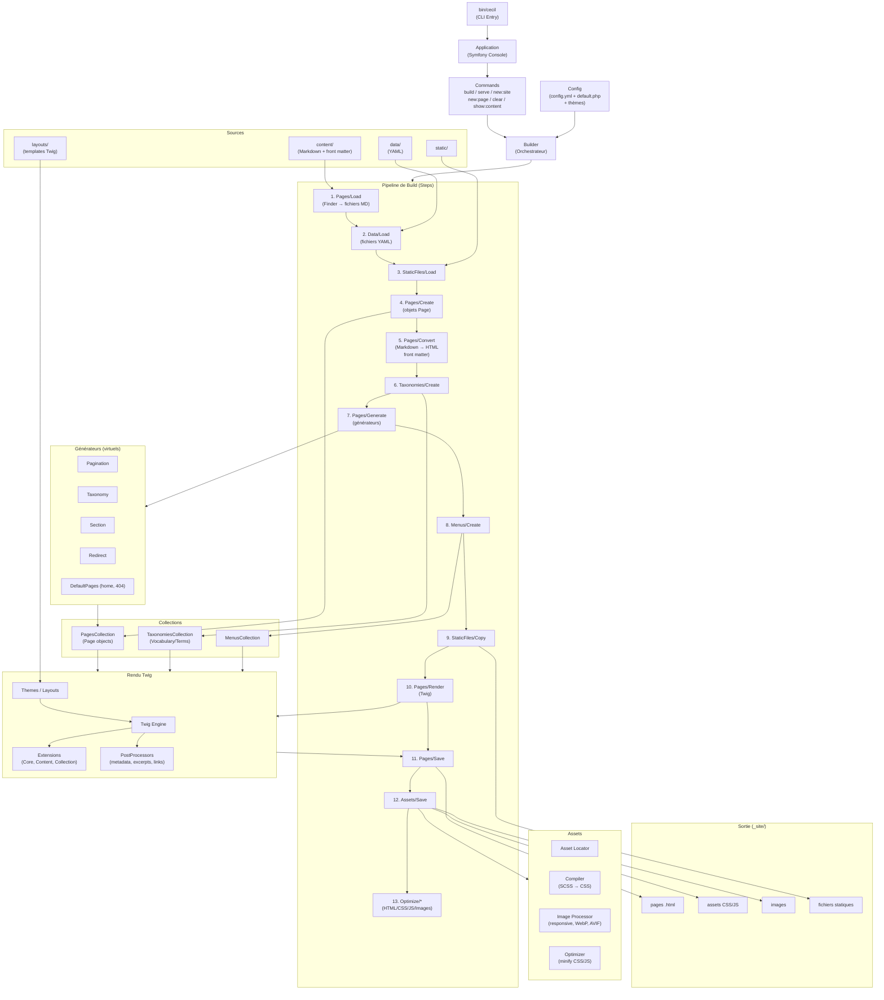

<!--
description: "Architecture de Cecil."
date: 2026-05-27
-->
# Architecture

## Diagramme

## Légende des composants clés

| Composant           | Rôle                                                                                 |
|---------------------|--------------------------------------------------------------------------------------|
| **Builder**         | Orchestrateur central, exécute les steps en séquence                                 |
| **Config**          | Fusion config défaut + thème + projet + CLI                                          |
| **Steps**           | Pipeline modulaire (13 étapes), chacune avec `init()` / `canProcess()` / `process()` |
| **Collections**     | Pages, Taxonomies, Menus — structures de données centrales                           |
| **Generators**      | Créent des pages virtuelles (pagination, tags, redirections…)                        |
| **Renderer (Twig)** | Applique les templates + extensions + post-processors                                |
| **Assets**          | Compile SCSS, optimise images, fingerprinte les fichiers                             |
