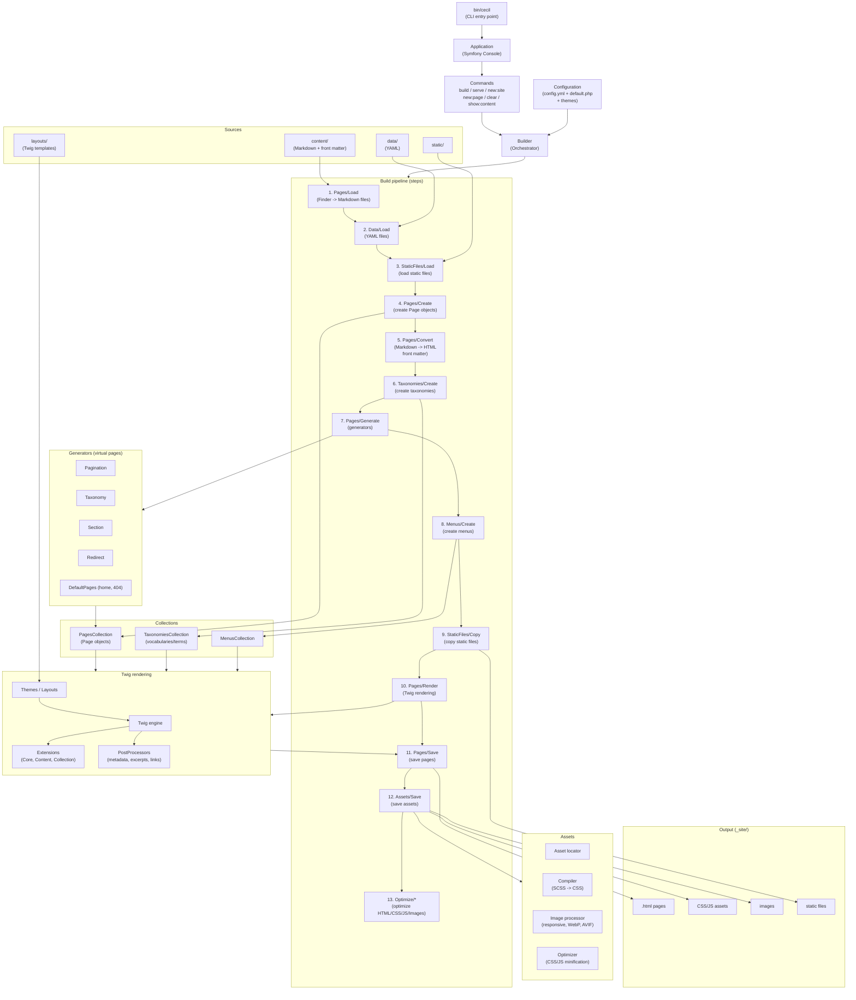

<!--
description: "Cecil architecture."
date: 2026-05-27
updated: 2026-06-08
-->
# Architecture

## Diagram

## Key Components Legend

| Component         | Role                                                                            |
|-------------------|----------------------------------------------------------------------------------|
| **Builder**       | Central orchestrator that executes steps in sequence                            |
| **Config**        | Merges default + theme + project + CLI configuration                            |
| **Steps**         | Modular pipeline (13 steps), each with `init()` / `canProcess()` / `process()` |
| **Collections**   | Pages, Taxonomies, Menus: core data structures                                  |
| **Generators**    | Create virtual pages (pagination, tags, redirects, etc.)                        |
| **Renderer (Twig)** | Applies templates + extensions + post-processors                              |
| **Assets**        | Compiles SCSS, optimizes images, fingerprints files                             |
